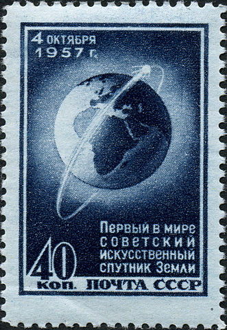

[](https://circleci.com/bb/q231950/sputnik/tree/master) 

# 🛰 спутник

## Talk to  CloudKit. Server-to-Server in Go.

> **Sputnik** enables you to connect to CloudKit from within your Go package or application using CloudKit's Server-to-Server Web Service API. **Sputnik** handles request signing for you and offers ways to interact with CloudKit directly from the CLI.

### Signing Requests

Sputnik manages the most cumbersome part of CloudKit communication - the signing of your requests. For more information on signing have a look in the [Managing the Signing Identity](https://github.com/q231950/sputnik/wiki/Managing-the-Signing-Identity) section of the [Wiki](https://github.com/q231950/sputnik/wiki).

### Usage

You can use Sputnik either from [the command line](https://github.com/q231950/sputnik/wiki/Sending-Requests#the-sputnik-binary) or [as a package](https://github.com/q231950/sputnik/wiki/Sending-Requests#the-sputnik-package). For more information about requests have a look in the [Sending Requests](https://github.com/q231950/sputnik/wiki/Sending-Requests) section of the [Wiki](https://github.com/q231950/sputnik/wiki).

[Baikonur](https://github.com/q231950/baikonur) uses Sputnik to insert city records into a CloudKit container:

```go
keyManager := keymanager.New()

config := requesthandling.RequestConfig{Version: "1", ContainerID: "iCloud.com.some.bundle", Database: "public"}
requestManager := requesthandling.New(config, &keyManager)

request, error := requestManager.PostRequest("modify", json)
client := &http.Client{}
response, error := client.Do(request)
```

## State

Please try this package and see how it works for you. Feedback and contributions are welcome <3


